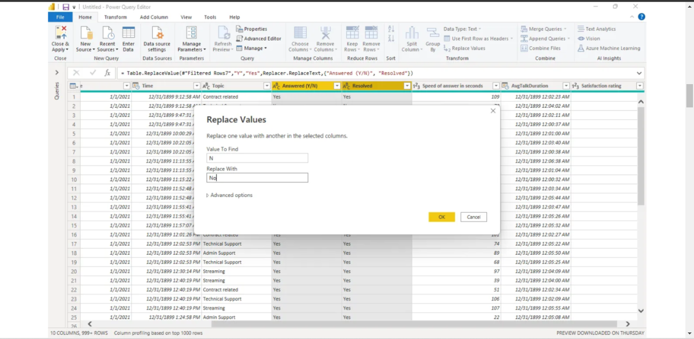
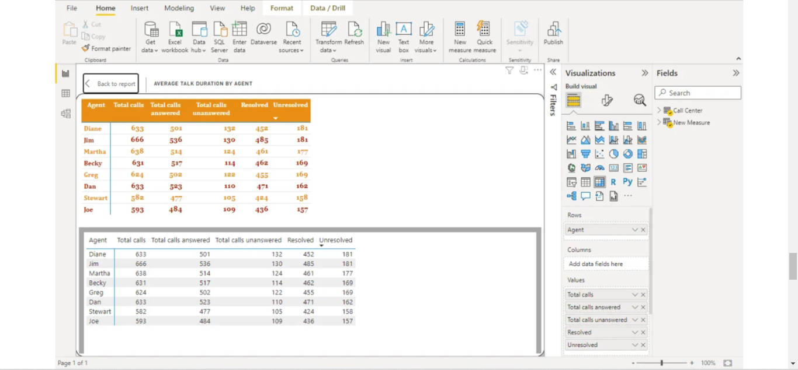
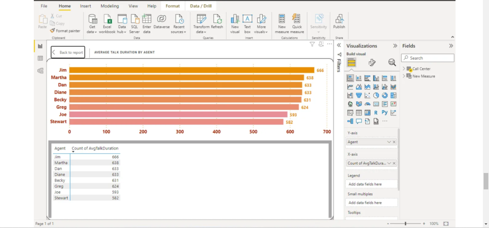
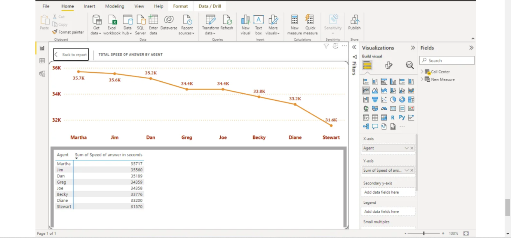
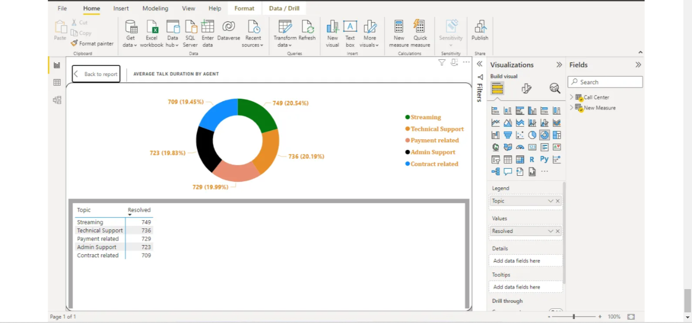

# Call-Center-Trend
---

## INTRODUCTION

The benefits of Call Center Trend Analysis Trend analysis can provide call centers with valuable insights into customer behavior, call volume, and agent performance. By analyzing call data over time, call centers can identify trends and patterns that can help them make data-driven decisions to improve their operations. This is  a PowerBI project on Trends at a call center of **PhoneNow**

## PROBLEM STATEMENT
1. Overall customer satisfaction
2. Overall calls answered/abandoned
3. Calls by time
4. Average speed of answer
5. Agent’s performance quadrant i.e average handle time (talk duration) vs calls answered

##SKILLS DEMONSTRATED

- DAX
- Power Query
- Tooltips
- Filters
- Buttons
- New Measures

## METHODOLOGY

To perform trend analysis using Excel and Power BI, i followed these steps:
1.**Collected call center data

2. Transformed Data in Power Query**

3. **Calculated New Measures with DAX functions;**
- Average Satisfaction Rating = AVERAGE('Call Center'[Satisfaction rating])
- Average speed answered = AVERAGE('Call Center'[Speed of answer in seconds])
- Count of Satisfaction Rating = COUNT('Call Center'[Satisfaction rating])
- Overall customer satisfaction = DIVIDE([Positive satisfaction rating], [Count of Satisfaction Rating], 0)
- Positive satisfaction rating = CALCULATE(COUNT('Call Center'[Satisfaction rating]), FILTER('Call Center', 'Call Center'[Satisfaction rating] IN {4,5}))
- Resolved = COUNTX(FILTER('Call Center', 'Call Center'[Resolved] = "Yes"), 'Call Center'[Resolved])
- Total calls = CALCULATE('New Measure'[Total calls answered] + 'New Measure'[Total calls unanswered])
- Total calls answered = COUNTX(FILTER('Call Center', 'Call Center'[Answered (Y/N)] = "Yes"), 'Call Center'[Answered (Y/N)])
- Total calls unanswered = COUNTX(FILTER('Call Center', 'Call Center'[Answered (Y/N)] = "No"), 'Call Center'[Answered (Y/N)])
- Unresolved = COUNTX(FILTER('Call Center', 'Call Center'[Resolved] = "No"), 'Call Center'[Resolved])

## VISUALIAZATION

**Insights**

1. Individual perforamnce each agent. This chart is just to show how much work each Agent has done.

2. **Total Satisfaction Rating** for each Agent.

3. **Agent** has the highest Total Speed of answer.

4. **Talk Duration** based on the Topic.

You can interact with the dashboard [here](https://app.powerbi.com/groups/me/reports/2763cbe5-2005-4a8b-89ee-d19577158e32/ReportSection)

## CONCLUSION & RECOMMENDATION 
**PhoneNow** should increase automation, provide multichannel support, and improve customer experience by minimizing wait times, resolving issues quickly and effectively. 
